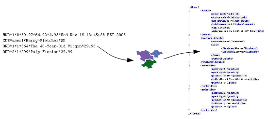

<span data-page-nav="./index"></span>

<div class="main-page-logo">
    
<div>

__Smooks__ is an extensible framework for building applications for processing XML and non XML
data (CSV, EDI, Java etc) using Java.

To use Smooks, simply add the following dependency to your project.

```xml
<dependency>
    <groupId>org.milyn</groupId>
    <artifactId>milyn-smooks-all</artifactId>
    <version>1.7.0</version>
</dependency>
```

See [Maven Central](https://mvnrepository.com/artifact/org.milyn/milyn-smooks-all) for a list of available versions.

# What can it be used for?

While Smooks can be used as a lightweight platform on which to build your own custom processing logic (for a wide
range of data formats "out of the box"), it comes with some very useful features that can be used individually,
or seamlessly combined together.

### Java Binding

Populate a Java Object Model from a data source (CSV, EDI, XML, Java etc). Populated object models can be used as a 
transformation result itself, or can be used by (e.g.) Templating resources for generating XML or other character
based results. Also supports __Virtual Object Models__ (Maps and Lists of typed data), which can be used by EL and 
Templating functionality.


### Transformation

Perform a wide range of __Data Transforms__ - XML to XML, CSV to XML, EDI to XML, XML to EDI, XML to CSV, Java to XML,
Java to EDI, Java to CSV, Java to Java, XML to Java, EDI to Java etc.



### Huge Message Processing

Process __huge messages__ (GBs) - __Split__, __Transform__ and __Route__ message fragments to __JMS__, __File__,
__Database__ etc destinations.


### Message Enrichment

__Enrich__ a message with data from a __Database__, or other Datasources.


